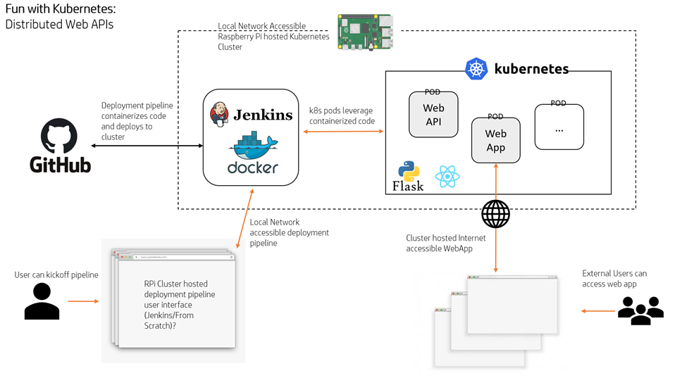

# Project Summary

- Kubernetes Cluster on Raspberry Pi
- Deployment pipeline for containerized applications
- Web API for project management

---

# Goals

- Make it easy for developers to deploy containerized applications to a K8S cluster
-

# Requirements

1. Kubernetes Setup
2. Project Config File
3. Github Container Build Pipeline
4. Kubernetes Deployment Pipeline
5. Deployment UI Website
6. Final Integration
7. Beta Testing

# Deliverables

## 1. Kubernetes Setup

(a) Install Kubernetes on the Raspberry Pi (1-2 days)
(b) Configure Kuberentes on the Raspberry Pi (1-2 days)
(c) Connect to the Raspberry Pi Admin tools with K8S Lens (3 Days)
(d) Test Kubernetes on the Raspberry Pi (3 days)
(e) Code reviews and release (4-5 Days)

## 2. Kubernetes CI/CD Config File Integration

(a) Research what settings are needed (2-3 days)
(b) Work with Deployment UI Website team to define template format (4-6 days)
(c) Create end-user documentation for config template (1 days)

## 3. Github Container Pipeline

(a) Create build script to pull repo from user-provided repository (1 day)
(b) Modify build script to build container image (1-3 days)
(c) Coordinate with K8S Deployment team to define container handoff API (2-3 days)
(d) Modify build script to send built image to K8S onboarding (1-2 days)
(e) Modify script to ensure clean building environment (1-2 days)
(f) Code Reviews and release (4-5 Days)
<!-- (f) Modify script to use user-selected generic Dockerfile if none provided (3-4 days) [stretch] -->
<!-- (g) Integrate build pipeline with Github Actions (5-7days) [stretch] -->

## 4. Kubernetes Deployment Pipeline

(a) Watch the images in the deployment area (1-2 days)
(b) Deploy a new image in the deployment area (2-3 Days)
(c) Coordinate with Github Container Build team to define container handoff API (2-3 Days)
(d) Testing (2-3 Days)
(e) Code Reviews and release (4-5 Days)

## 5. User-facing Deployment UI Website

## 6. Final Integration

## 7. Beta Testing

# Tasks

# Component Interfaces

# Management Method

# Sprint Deliverables
