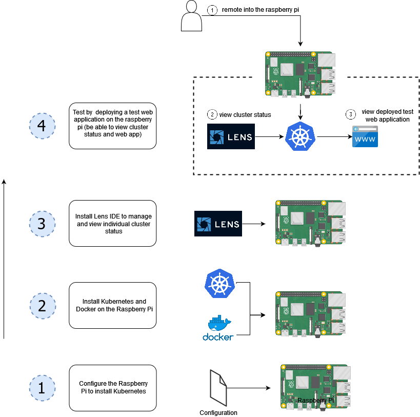
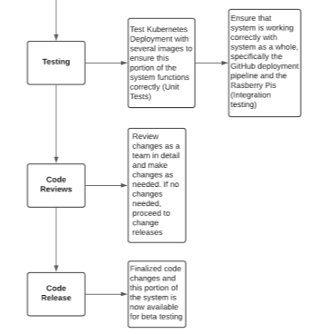

# Project Summary

- Kubernetes Cluster on Raspberry Pi
- Deployment pipeline for containerized applications
- Web API for project management

---

# Goals

- Make it easy for developers to deploy containerized applications to a K8S cluster
- Operate at a lower operating cost compared to industry solutions
- Provide scalability, either up or down
- Intuitive and easy to use for end users

# Deliverables

- Kubernetes deployed on Raspberry Pi devices
- Deployment pipeline running on a cluster of Raspberry Pi devices
- Able to deploy a user’s service to the Kubernetes cluster from a user-provided config file
- User must be able to access pipeline from local network
- Service hosted on Raspberry Pi’s must be available on the internet

# Requirements

1. Kubernetes Setup
2. Project Config File
3. Github Container Build Pipeline
4. Kubernetes Deployment Pipeline
5. Deployment UI Website
6. Final Integration
7. Beta Testing

# Requirement Breakdown

## 1. Kubernetes Setup

{ width=60% }

## 1. Kubernetes Setup

a. Install Kubernetes on the Raspberry Pi (1-2 days)
b. Configure Kuberentes on the Raspberry Pi (1-2 days)
c. Connect to the Raspberry Pi Admin tools with K8S Lens (3 Days)
d. Test Kubernetes on the Raspberry Pi (3 days)
e. Code reviews and release (4-5 Days)

## 2. Kubernetes CI/CD Config File Integration

## 2. Kubernetes CI/CD Config File Integration

a. Research what settings are needed (2-3 days)
b. Work with Deployment UI Website team to define template format (4-6 days)
c. Create end-user documentation for config template (1 days)
d. Code reviews and release (4-5 Days)

## 3. Github Container Pipeline

## 3. Github Container Pipeline

a. Create build script to pull repo from user-provided repository (1 day)
b. Modify build script to build container image (1-3 days)
c. Coordinate with K8S Deployment team to define container handoff API (2-3 days)
d. Modify build script to send built image to K8S onboarding (1-2 days)
e. Modify script to ensure clean building environment (1-2 days)
f. Code Reviews and release (4-5 Days)

## 4. Kubernetes Deployment Pipeline

:::::: {.columns}
::: {.column width="50%"}

:::
::: {.column width="50%"}

:::
::::::

## 4. Kubernetes Deployment Pipeline

a. Watch the images in the deployment area (1-2 days)
b. Deploy a new image in the deployment area (2-3 Days)
c. Coordinate with Github Container Build team to define container handoff API (2-3 Days)
d. Testing (2-3 Days)
e. Code Reviews and release (4-5 Days)

## 5. User-facing Deployment UI Website

## 5. User-facing Deployment UI Website

a. Create a clean and usable web UI (3-6 days)
b. Containerize the web UI and self-host on the cluster (1 day)
c. Create an interface to pass app and config to the pipeline for deployment (3-6 days)
d. Expose admin tools, such as Lens IDE (2-7 days)
e. Set up authentication (3-5 days)
f. Code reviews and release (4-5 days)
<!-- g. Set up an automated system for containerizing an application (2-4 days) [stretch] -->

## 6. Final Integration

## 7. Beta Testing

# Tasks distribution

Phase 1: TM1
Phase 2: TM2
Phase 3: TM3
Phase 4: TM4
Phase 5: TM5

# Component Interfaces

## 1. Kubernetes

## 2. Config Template

- coordinate with Phase 5
- site will take this data from user and generate template
- specifics will be added when needed

## 3. Github Build

- coordinate with Phase 4
- Docker builds image and stores internally
- needs to be passed to K8S somehow

## 4. K8S Onboarding

## 5. Management Site

- coordinate with Phase 2
  - needs to expose required settings for user input
  - generate config for Phase 3

- coordinate with Phase 1
  - how to expose Lens UI to developers

# Integration

## Task 3 and 4: Image Handoff

- How does Kubernetes know where the generated Docker image is?
  - To be decided by both task leads

## Task 2 and 5: UI Passing Config Settings

- What configuration settings are required from the user?
  - Will be confirmed during task 2
- How should the required settings be passed to the script that generates the config file?
  - Probably JSON or YAML
  - Will be decided by task leads as needs develop

## Task 3 and 5: UI to Pipeline Communication

- Where is the build script for the pipeline?
  - Will be decided by the task 3 lead and communicated to the task 5 lead
- How should the repo be passed?
  - Probably via command line

## Task 1 and 5: Exposing Lens

- Much of the implementation details are currently uncertain
  - will be worked out by the task leads as the UI develops
  - Currently have a few basic concepts brainstormed that we are looking into
  - Lens will likely be running on the cluster and will connect to the container running the UI

# Schedule

## Fall term:

- Sprint 2: phase 1
- Sprint 3: phase 2 (1/2)

## Winter term:

- Sprint 4: phase 2 (2/2), phase 3 (1/2), phase 4, phase 5 (1/2)
- Sprint 5: phase 3 (2/2), phase 5 (2/2)
- Sprint 6: Integration

## Spring term:

- Sprint 7: Beta testing

# Management

# Sprint Goals

## Sprint 2 (11/1 to 11/21)

**Planned Deliverables:**

- Installation & configuration of cluster
  - Kubernetes
  - K8S Lens

**Dependencies:**

- None

## Sprint 3 (11/22 to 12/12)

**Planned Deliverables:**

- Configuration files for K8S can be generated from user options
- Lens is installed and running on the cluster

**Dependencies:**

- K8S is installed and working on the devices

## Sprint 4 (1/3 to 1/23)

**Planned Deliverables:**

- Pipeline functional
- Builds image from GitHub repo
- Image then detected and launched by K8S
- UI hosted and accessible on cluster
- Site can pass app config to and trigger build pipeline

**Dependencies:**

- K8S is installed and working on the devices
- K8S config files can be generated from user options

##  Sprint 5 (1/24 to 2/13)

**Planned Deliverables:**

- Authentication required for pipeline UI to prevent unauthorized attempts to access the cluster
- Admin tools from Lens exposed by UI

**Dependencies:**

- K8S is installed and working on the devices
- Lens running on cluster
- UI running on cluster

## Sprint 6 (2/14 to 3/6)

**Planned Deliverables:**

- Integration testing completed

**Dependencies:**

- All previous deliverables

## Sprint 7 (3/28 to 4/17)

**Planned Deliverables:**

- Beta testing complete

**Dependencies:**

- Integration finished
