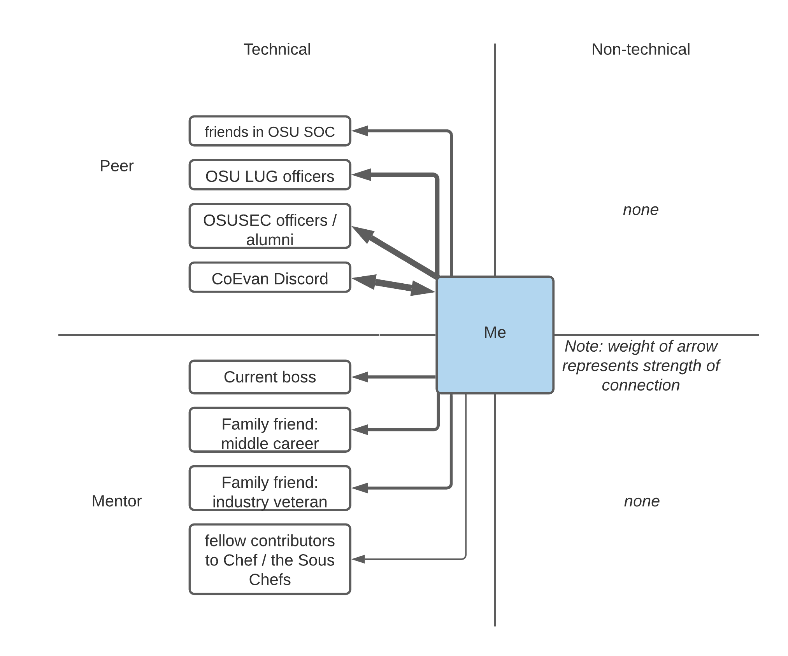

# Professional Network

## Robert Detjens

---

### Diagram

### Network Goals

Currently, most of my network is technical and related to my field. I don't know
many people that are not related to CS or similar. One of my goals for this year
is to branch out and meet people outside of CS and start building non-technical
connections.

I also need to reach out to some of my professional connections to explore
possibilities. I have a couple family friends in CS jobs that have strong
connections to others, including one who is an industry veteran and can likely
recommend or point me to opportunities at some of the large tech companies he
has worked for.
