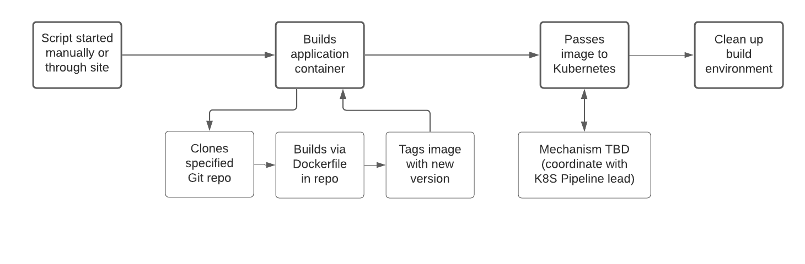

# WIC: Individual Contribution

## Robert Detjens

---

### Process Flows

\pagebreak

### User Stories

As a user of the deployment service, I want my application to be built quickly so that I can rapidly develop my
application and not wait on the build service.

As a user of the deployment service, I want my applications to be built correctly according the the rules I set so that
I know the application works as intended.

As a user of the deployment service, I want my applications to be built reproducibly so that the built image is the same
as would be created in a local dev environment.

As a developer, I want the deployment pipeline to be simple so that it can be easily worked on and maintained with new
features.

As the project partner, I want a working pipeline so that the full product can be delivered.

As the end user of a deployed project, I want the container to be built correctly so that the application is functional.

### Personal Iteration Plan

The phase of the project I am responsible for is the Docker image build pipeline -- turning a user's application
repository into a deployable container image. This phase is blocked on the Kubernetes install (phase 1) and the
user-provided config file design (phase 2). Once these have been completed in Sprint 3, that unblocks my phase to begin
implementation in Sprint 4. The final steps of this build pipeline need to be coordinated with the Kubernetes image
onboarding pipeline (phase 4), and as such will be blocking until we can coordinate that handoff procedure.

While my phase is blocking, I will be assisting my other teammates with the current phase being worked on, such as
assisting in designing the template file for Phase 2 and integrating all components together.

Broken up by sprint, the plan is as follows:

- Sprint 2: Assist in setting up access to the Pi to facilitate the install
- Sprint 3: Assist team in researching needed config values for config file
- Sprint 4: Begin implementing build pipeline
- Sprint 5: Finish implementing build pipeline and coordinate image handoff procedure
- Sprint 6: Assist in final integration of components together
- Sprint 7: Help manage beta testing and feedback

### Solution Architecture

Our team will be working on the project in 5 discrete phases in order to maximize available time and share the work of
managing parts of the pipeline between each team member. Most of our components are easily modularized, however some
depend on each other and will require each component team to coordinate solutions where their domains overlap.

The first phase must be completed before working on subsequent phases, as all following phases require interaction with
Kubernetes. We will be using the K3S implementation of Kubernetes [@k3s], as it is resource-light while being
feature-complete. We do not need the more powerful features of full-fat K8S detailed in [@comp] as this cluster will be
running only on one machine, not hundreds. The smaller footprint of k3s will also more of the compute power available
for client applications.

We will also be using Lens [@lens] to provide an admin dashboard for the Kubernetes cluster, both for internal use and
eventually for exposing management to end developers. This was recommended by our project partner and from our research
we agree with their recommendation.

## List of Terms

*Docker*
: A containerization platform that packages software in a lightweight, isolated, and portable environment called a
container. <https://www.docker.com/>

*Kubernetes*
: An open-source container-orchestration system for automating computer application development, scaling, and
  management. <https://kubernetes.io/>

*Pipeline*
: A set of automated processes that allow developers to reliably and efficiently compile, build, and deploy their code
  to their production compute platforms.

*Container*
: A fully-contained application that bundles all of its dependencies in one package and can be deployed easily

*Repository*
: A hosted version of source code tracked via a version control program such as Git

## References

::: {#refs}
:::

---
csl: ieee.csl
references:
  - id: k3s
    author: k3s-io
    container-title: GitHub repository
    issued: 2021
    publisher: Rancher
    title: K3s Lightweight Kubernetes
    url: https://github.com/k3s-io/k3s
  - id: comp
    author:
    - family: Roy
      given: Hrittik
    container-title: p3r
    issued: 2021-07
    publisher: p3r
    title: "K8s vs K3s: The comprehensive difference"
    title-short: K8s vs K3s
    url: "https://www.p3r.one/k8s-vs-k3s/"
  - id: lens
    author: lensapp
    container-title: Github repository
    publisher: Mirantis, Inc
    title: Lens - The Kubernetes IDE
    url: "https://github.com/lensapp/lens"
---
